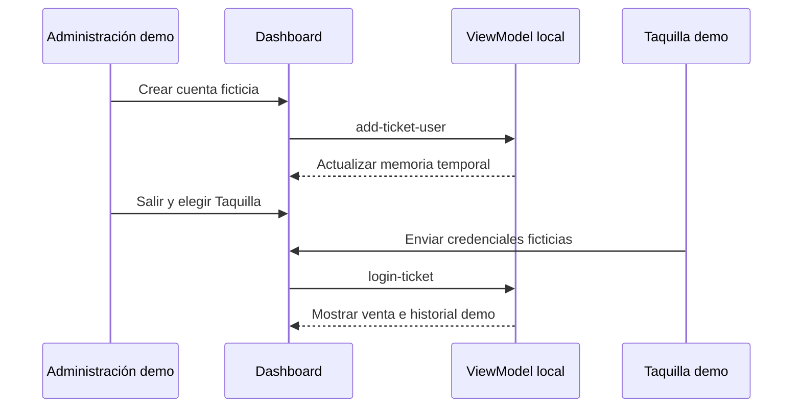

# Arquitectura de `apps/dashboard`

> Documento de arquitectura de la SPA de demostración. La línea base general permanece en propuesta; este documento no aprueba integraciones operativas.

## 1. Control

- **Estado:** Propuesta
- **Responsable:** Por identificar según acuerdo del equipo
- **PR de aprobación:** Pendiente
- **Capacidades descritas:**
  - Dashboard de demostración: `actual`
  - Selección de perfiles y login ficticio de administración y taquilla: `actual`
  - Edición en memoria de recintos y alta de usuarios ficticios: `actual`
  - Venta e historial de boletos ficticios: `actual`
  - Autenticación real, permisos del servidor y persistencia: `futura`
  - Integración de pagos: `futura/inactiva`

## 2. Propósito, alcance y exclusiones

- **Problema y propósito:** presentar pantallas navegables para revisar la experiencia administrativa y de taquilla del zoológico.
- **Incluye:** panel de muestra, noticias y eventos de muestra, modificación temporal de recintos, alta temporal de usuarios de taquilla, login ficticio para ambos perfiles, venta visual, reporte e historial de muestra.
- **No incluye:** autenticación/autorización real, persistencia, API, base de datos, operaciones reales de ventas o reportes y cobros.
- **Capacidades futuras:** integración autenticada con la API Laravel mediante `@arca/api-client`, con permisos y fuente de datos del servidor definidos por una spec posterior.

## 3. Actores

| Actor | Necesidad | Permiso o confianza |
|---|---|---|
| Administración de demostración | Recorrer el panel, los recintos y el alta ficticia de usuarios | Perfil visual local; no constituye permiso |
| Taquilla de demostración | Recorrer la venta y el historial de muestra | Login ficticio visible y local; no protege información |
| Equipo de desarrollo | Revisar la experiencia y su código | Acceso al repositorio |

## 4. Módulos internos

| Módulo/feature | Estado | Responsabilidad | Dueño de datos |
|---|---|---|---|
| Shell y navegación por perfil | Actual | Seleccionar vistas de acuerdo con el estado de demostración | ViewModel local |
| Administración de recintos | Actual | Presentar y editar fixtures solo en memoria | ViewModel local |
| Usuarios de taquilla | Actual | Presentar una cuenta de muestra y crear cuentas efímeras | ViewModel local |
| Venta e historial de taquilla | Actual | Presentar transiciones y filas ficticias sin operación real | Fixtures y ViewModel local |
| Noticias, eventos y reporte | Actual | Presentar contenido estático de demostración | `src/data/demo-data.ts` |
| API, identidad y persistencia | Futura | Integrar contratos y permisos operativos | API Laravel/MySQL, por especificar |
| Payments | Futura/inactiva | Ninguna capacidad activa en el dashboard de muestra | No aplica |

## 5. Estructura prevista en `src/`

```text
src/
  components/      # Banner, iconos locales y encabezados compartidos de la app
  data/            # Fixtures explícitamente ficticios
  tests/           # Pruebas Vitest por criterio de aceptación
  viewmodels/      # Estado y acciones locales mediante reducer y hook
  views/           # Vistas React para cada pantalla
  App.tsx          # Shell y selección de vistas
  main.tsx         # Punto de entrada React
  styles.css       # Tokens semánticos aplicados y layout responsive
```

La organización separa presentación (`views`), coordinación de estado (`viewmodels`) y fixtures (`data`). No hay capa de dominio de negocio ni cliente HTTP en esta demostración.

## 6. Patrón MVC o MVVM

- **Patrón aplicable:** MVVM para React.
- **View:** componentes en `src/views/` y shell en `src/App.tsx`.
- **ViewModel:** reducer `dashboardDemoReducer` y hook `useDashboardDemo`.
- **Datos:** fixtures ficticios en `src/data/demo-data.ts`; la API no participa.
- **Excepciones:** el flujo local de acceso no es autenticación y no sustituye el patrón servidor/API de una futura app operativa. No se aprueba ninguna excepción a la arquitectura general.

## 7. Componentes

| Componente | Estado | Entrada/salida | Responsabilidad |
|---|---|---|---|
| `App` | Actual | Estado del hook → shell y vista activa | Seleccionar navegación según perfil |
| `LoginView` | Actual | Perfil, error y callbacks locales | Mostrar selector y formularios ficticios de ambos perfiles |
| `EnclosuresView` | Actual | Recintos y callback de actualización | Presentar formulario de edición temporal |
| `TicketUsersView` | Actual | Cuentas y callback de creación | Presentar alta efímera de usuarios |
| `TicketSaleView` | Actual | Estado de venta y callbacks | Recorrer venta sin cobro |
| `TicketHistoryView` | Actual | Fixtures estáticos | Filtrar y presentar historial ficticio |
| `useDashboardDemo` | Actual | Acciones locales | Exponer el reducer a la shell |
| `@arca/ui` y `@arca/tokens` | Actual | Componentes y roles visuales | Controles y estilos semánticos compartidos |

## 8. Dependencias

- **Internas:** `@arca/ui`, `@arca/tokens`.
- **Externas aprobadas:** React 19, React DOM, TypeScript, Vite 7, Tailwind CSS 4 y Vitest.
- **Dirección:** `views` consumen componentes/tokens y acciones del ViewModel; `App` compone las vistas. Los fixtures alimentan el ViewModel y las vistas.
- **No usadas/prohibidas para esta feature:** `@arca/api-client` (no hay contrato de API), llamadas ad hoc de red, almacenamiento local, router nuevo, servicios de nube y proveedores de pago.
- No se agregan dependencias ni se propone ADR nuevo.

## 9. Endpoints consumidos o expuestos

No hay endpoints consumidos o expuestos por esta demostración. Una futura integración deberá tener spec y plan propios antes de introducir contratos Laravel nombrados.

## 10. Datos y flujo

- **Fuente actual:** fixtures estáticos y estado React en memoria; no hay fuente de datos operativos.
- **Tema actual:** `@arca/tokens` conserva los defaults institucionales y la SPA mapea los aliases `--dashboard-*` a tokens institucionales desde `src/styles.css`. Mantiene tokens semánticos de éxito, advertencia, error y foco. No consulta `settings_colores` ni `GET /api/theme`.
- `index.html` es la entrada de Vite que establece metadatos y monta `/src/main.tsx`; no contiene las vistas, estado ni CSS completo.
- **Persistencia/auditoría:** ninguna. No se crea base de datos, cookie, `localStorage` ni `sessionStorage`.
- **Flujo de administración:** seleccionar Administración → ingresar `administrador@demo.local` / `demo1234` → editar recintos o crear usuarios ficticios → recibir feedback local.
- **Flujo de taquilla:** seleccionar Taquilla → comparar en memoria credenciales públicas de muestra → mostrar venta e historial ficticios → salir vuelve al selector.
- Las cuentas creadas sobreviven al cambio de perfil mientras la página está cargada; un refresco las elimina. Los recintos editados también regresan a los fixtures al refrescar.
- La venta no calcula importes ni genera transacciones. Los filtros solo recorren fixtures.

## 11. Seguridad, errores y privacidad

- No se manejan personas ni transacciones reales.
- Las credenciales ficticias iniciales de ambos perfiles son texto público dentro del bundle cliente; no son secretos y no deben reutilizarse.
- La lista temporal de cuentas y claves se mantiene en memoria exclusivamente para la demostración.
- El estado de perfil no autoriza ni protege el contenido del bundle. Los controles ocultos no constituyen controles de seguridad.
- Formularios y errores se presentan en español con etiquetas, estados accesibles y corrección local.
- Una versión real requiere autenticación, autorización en Policies/servidor, contrato de API, auditoría y datos MySQL mediante su propia spec.

## 12. Pruebas

| Criterio | Prueba |
|---|---|
| CA-01..CA-02 | `login.test.tsx`, `dashboard.test.tsx` |
| CA-03 | `content-management.test.tsx` |
| CA-04 | `ticket-sale.test.tsx` |
| CA-05 | `ticket-report.test.tsx` |
| CA-06 | `responsive.test.tsx` y comprobación en navegador |
| CA-07 | `acceptance-coverage.test.tsx` (CA-01..CA-14) |
| CA-08 | `design-system.test.tsx`, `npm run types`, `npm run build` |
| CA-09 | `enclosures.test.tsx` |
| CA-10 | `login.test.tsx` |
| CA-11 | `ticket-history.test.tsx` |
| CA-12 | `ticket-users.test.tsx` y comprobación de la guía |
| CA-13 | `login.test.tsx` y transiciones del ViewModel |
| CA-14 | `design-system.test.tsx` y `responsive.test.tsx` |

## 13. Diagrama de componentes

```mermaid
flowchart LR
  Actor[Personal de demostración] --> View[LoginView y vistas React]
  View --> App[App y navegación por perfil]
  App --> VM[useDashboardDemo y dashboardDemoReducer]
  VM --> Fixtures[Fixtures ficticios en memoria]
  View --> UI[@arca/ui y @arca/tokens]
```

## 14. Secuencias críticas



## 15. Riesgos, pendientes y ADRs

| Riesgo/pregunta | Mitigación o decisión requerida | ADR/spec | Responsable |
|---|---|---|---|
| El login parece seguridad real | Avisos visibles y guía; no usarlo con datos reales | Spec `001-admin-dashboard-prototype` | Solicitante |
| Se confunden filas con operación real | Etiquetar todos los fixtures y montos como ficticios | Spec `001-admin-dashboard-prototype` | Solicitante |
| El usuario espera persistencia | Avisar que cuentas/recintos se reinician al refrescar | Spec `001-admin-dashboard-prototype` | Solicitante |
| Integración operativa futura | Requiere contrato API, autorización y nueva aprobación; no está implementada | Spec futura | Responsable funcional por identificar |
| Stack | React/TypeScript/Vite/Tailwind según ADR 0002; no se añade tecnología | ADR 0002 | Equipo técnico |

## 16. Validación

- [x] Respeta el stack aprobado y no modifica la arquitectura general.
- [x] Distingue capacidades actuales de las futuras.
- [x] Declara MVVM y los límites de presentación.
- [x] No inventa endpoints ni integraciones.
- [x] Documenta seguridad, privacidad y pruebas.
- [x] No introduce excepciones ni ADRs nuevos.

## Participación futura en Payments

**FUTURA/INACTIVA.** Esta aplicación no implementa pagos electrónicos ni se conecta a un proveedor. El flujo de venta actual es ficticio y no procesa cobros, genera transacciones o emite boletos. Cualquier futura capacidad requerirá spec, ADR/proveedor y aprobación operativa, conforme a la arquitectura general.
