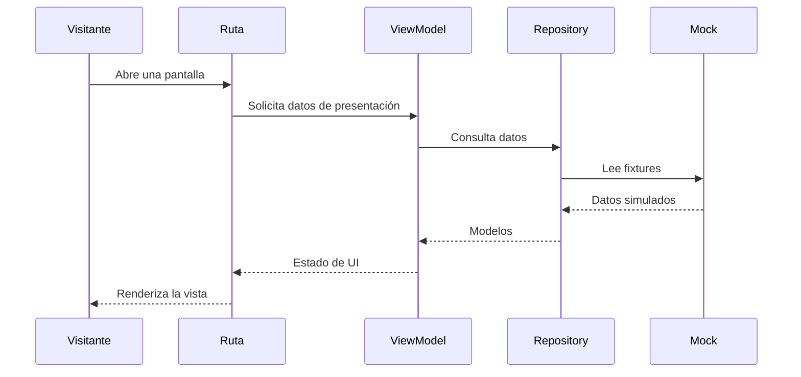

# Arquitectura de `apps/mobile`

## 1. Control

- **Estado:** Borrador; arquitectura local del prototipo de UI 002, pendiente aprobación en PR.
- **Capacidades descritas:** rutas, interfaz, mocks y pruebas: actual; API, favoritos persistentes, cámara, GPS y 3D: futuros.
- **Spec de referencia:** [002 · mobile-ui-base-visitor-journey](../specs/002-mobile-ui-base-visitor-journey.md).
- **Decisión tecnológica:** [ADR 0004 · Mobile React Native](../../../docs/adr/0004-mobile-react-native.md).

## 2. Propósito, alcance y exclusiones

La aplicación presenta al visitante una experiencia móvil de exploración del zoológico y permite validar sus flujos y diseño.

- **Actual:** cinco pestañas, búsqueda y detalle de animales, colección, perfil, eventos, misiones, logros y resultados QR simulados.
- **No incluido en 002:** conexión de datos de negocio a la API, persistencia, cámara/lectura QR real, GPS, mapa interactivo y renderizado 3D.
- **Futuro:** capacidades de dispositivo o persistencia solo se implementan con alcance aprobado en una spec correspondiente.

## 3. Actores

| Actor | Necesidad | Confianza |
|---|---|---|
| Visitante | Explorar el contenido educativo y probar los flujos de visitante | Cliente público; no contiene credenciales ni autoridad de negocio |
| Equipo de desarrollo | Ejecutar Expo Go, validar la UI y mantener los contratos del cliente | Acceso al código del monorepo |

## 4. Módulos internos

| Módulo | Estado | Responsabilidad | Fuente de datos |
|---|---|---|---|
| `src/app/` | Actual | Rutas Expo Router y composición de dependencias de presentación | ViewModels |
| `src/screens/` | Actual | Vistas props-driven de cada pantalla | Props y callbacks de rutas |
| `src/viewmodels/` | Actual | Estado y operaciones de presentación | Repositories |
| `src/repositories/` | Actual | Acceso desacoplado a datos simulados | Mocks |
| `src/mocks/`, `src/models/` | Actual | Fixtures y tipos de dominio de UI | Código fuente de Mobile |
| `src/components/`, `src/theme/` | Actual | Componentes compartidos, símbolos y adaptación de tokens | `@arca/tokens`, `expo-symbols` |

## 5. Estructura de `src/`

```text
src/
  app/          # Expo Router y rutas
  components/   # UI y componentes de dominio
  mocks/        # Fixtures
  models/       # Tipos de la UI
  repositories/ # Contratos e implementación mock
  screens/      # Vistas
  theme/        # Adaptador de tokens
  viewmodels/   # Hooks/estado de presentación
```

`apps/mobile/src` es el único árbol de código de la app. No se debe crear otro `apps/src`.

## 6. Patrón MVVM

El flujo actual es `Route → Screen/View → ViewModel hook → Repository → Mock`. Las rutas coordinan navegación y datos de presentación; las pantallas reciben props y callbacks. Los repositorios pueden sustituir los mocks por un origen futuro sin acoplar las vistas.

## 7. Componentes

Las pantallas en `src/screens/` componen controles de `src/components/ui/` y componentes de dominio. `BackButton`, `ScreenContainer`, textos, cards, chips, iconos y placeholders de imagen forman parte del kit compartido móvil.

## 8. Dependencias

- **Internas:** `@arca/tokens` y `@arca/api-client`, desde los workspaces `packages/`.
- **Runtime móvil:** Expo SDK 57, Expo Router, React Native 0.86 y `expo-symbols`.
- **Pruebas/desarrollo:** Jest, `jest-expo`, React Native Testing Library y TypeScript.
- Metro resuelve workspaces desde la raíz del monorepo mediante `metro.config.js`.
- No hay dependencias de cámara, geolocalización, mapas ni motor 3D en el alcance actual.

## 9. Contratos y endpoints

La etapa 002 no consume endpoints. `@arca/api-client` está declarado para contratos compartidos futuros, pero los datos de las pantallas proceden de mocks.

## 10. Datos y flujo

No hay persistencia local o remota en esta etapa. Los repositorios exponen fixtures de `src/mocks/`; cambiar o cerrar la app restablece el estado temporal. El servidor/API será autoridad de los datos de negocio cuando una spec futura integre esos flujos.

## 11. Seguridad y privacidad

El prototipo no solicita permisos de cámara ni ubicación y no debe contener secretos o tokens de servicio. El QR y el mapa son simulaciones visuales, no flujos de captura de datos.

## 12. Pruebas

Las pruebas Jest cubren arquitectura/imports, rutas, UI, ViewModels y Repositories; `npx tsc --noEmit` comprueba tipos. La revisión visual Android/Expo Go es una validación manual complementaria y se registra en la tarea T-28 de la spec 002.

## 13. Componentes y flujo

```mermaid
flowchart LR
  Route[Expo Router] --> Screen[Screen / View]
  Route --> VM[ViewModel hook]
  Screen -->|acciones/callbacks| Route
  VM --> Repo[Repository]
  Repo --> Mock[Mocks]
  Theme[Theme adapter] --> Tokens[@arca/tokens]
```

## 14. Secuencia de consulta visual



## 15. Riesgos y pendientes

| Pendiente | Tratamiento |
|---|---|
| Iconos de launcher Android/iOS | Agregar recursos PNG finales antes de builds distribuibles |
| Persistencia y favoritos | Definir en una spec futura; no inferir estado persistente de UI temporal |
| Cámara/QR real, GPS/mapa y 3D | Requieren alcance aprobado, permisos, dependencias y validación de dispositivos |
| Retirar referencia visual temporal | `arca-ui-reference` no es una dependencia y se mantiene fuera de Git |

## 16. Validación

- La estructura de código queda limitada a `apps/mobile/src`.
- Las capacidades mock y las futuras se identifican explícitamente.
- Expo está aprobado por ADR 0004; las integraciones de hardware no se asumen aprobadas por ese ADR.
