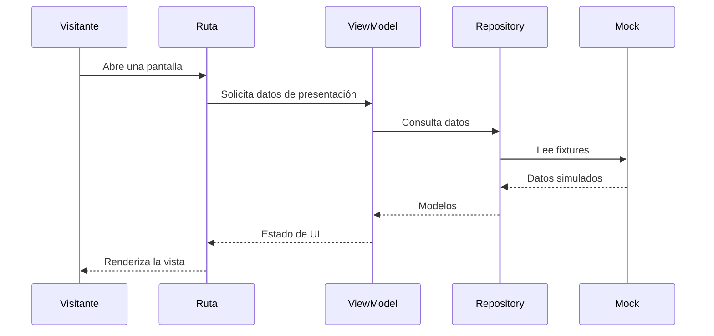

# Arquitectura de `apps/mobile`

## 1. Control

- **Estado:** Vigente. Cubre el prototipo de la spec **002** y la cuenta visitante de la spec **004** (Implementada, 2026-10-21).
- **Capacidades descritas:** rutas, interfaz, mocks, pruebas y cuenta visitante: actual. Catálogo de negocio, cámara, GPS y 3D: futuros.
- **Spec de referencia:** [002 · mobile-ui-base-visitor-journey](../specs/002-mobile-ui-base-visitor-journey.md) y [004 · visitor-account](../specs/004-visitor-account.md).
- **Decisión tecnológica:** [ADR 0004 · Mobile React Native](../../../docs/adr/0004-mobile-react-native.md).

## 2. Propósito, alcance y exclusiones

La aplicación presenta al visitante una experiencia móvil de exploración del zoológico y permite validar sus flujos y diseño.

- **Actual:** cinco pestañas, búsqueda y detalle de animales, colección, perfil, eventos, misiones, logros, resultados QR simulados, y la cuenta visitante (bienvenida, registro, verificación, sesión, recuperación, edición, cambio de contraseña y borrado). Con `EXPO_PUBLIC_API_URL` esa cuenta habla con la API; sin ella, y en Jest, sigue el mock.
- **No incluido en 002:** conexión de datos de negocio a la API, persistencia, cuenta real, cámara/lectura QR real, GPS, mapa interactivo y renderizado 3D. La cuenta real llegó con la spec 004.
- **Futuro:** capacidades de dispositivo o persistencia solo se implementan con alcance aprobado en una spec correspondiente. Roadmap y responsables de specs 003–008: [003-008-roadmap-y-asignacion.md](./003-008-roadmap-y-asignacion.md).

## 3. Actores

| Actor | Necesidad | Confianza |
|---|---|---|
| Visitante | Explorar el contenido educativo y probar los flujos de visitante | Cliente público; no contiene credenciales ni autoridad de negocio |
| Equipo de desarrollo | Ejecutar Expo Go, validar la UI y mantener los contratos del cliente | Acceso al código del monorepo |

## 4. Módulos internos

| Módulo | Estado | Responsabilidad | Fuente de datos |
|---|---|---|---|
| `src/app/` | Actual | Rutas Expo Router y composición de dependencias de presentación | ViewModels |
| `src/screens/` | Actual | Vistas props-driven de cada pantalla | Props y callbacks de rutas |
| `src/viewmodels/` | Actual | Estado y operaciones de presentación | Repositories |
| `src/repositories/` | Actual | Acceso desacoplado. La cuenta usa el mock si no hay `EXPO_PUBLIC_API_URL`; con esa variable usa `HttpAuthRepository` | Mocks o `@arca/api-client` |
| `src/mocks/`, `src/models/` | Actual | Fixtures y tipos de dominio de UI | Código fuente de Mobile |
| `src/components/`, `src/theme/` | Actual | Componentes compartidos, símbolos y adaptación de tokens | `@arca/tokens`, `expo-symbols` |

## 5. Estructura de `src/`

```text
src/
  app/          # Expo Router y rutas
  components/   # UI y componentes de dominio
  mocks/        # Fixtures
  models/       # Tipos de la UI
  repositories/ # Contratos, mock de cuenta y HttpAuthRepository
  screens/      # Vistas
  services/     # Almacenamiento del par de tokens
  session/      # Sesión de la cuenta visitante
  theme/        # Adaptador de tokens
  viewmodels/   # Hooks/estado de presentación
```

`apps/mobile/src` es el único árbol de código de la app. No se debe crear otro `apps/src`.

## 6. Patrón MVVM

El flujo es `Route → Screen/View → ViewModel hook → Repository`. Las rutas coordinan navegación y datos de presentación; las pantallas reciben props y callbacks. La cuenta usa el mock o `HttpAuthRepository`; el resto de repositorios sigue en mocks hasta su spec.

## 7. Componentes

Las pantallas en `src/screens/` componen controles de `src/components/ui/` y componentes de dominio. `BackButton`, `ScreenContainer`, textos, cards, chips, iconos y placeholders de imagen forman parte del kit compartido móvil.

## 8. Dependencias

- **Internas:** `@arca/tokens` y `@arca/api-client`, desde los workspaces `packages/`.
- **Runtime móvil:** Expo SDK 57, Expo Router, React Native 0.86, `expo-symbols` y `expo-secure-store` (ADR 0011, solo el par de tokens de la cuenta).
- **Pruebas/desarrollo:** Jest, `jest-expo`, React Native Testing Library y TypeScript.
- Metro resuelve workspaces desde la raíz del monorepo mediante `metro.config.js`.
- No hay dependencias de cámara, geolocalización, mapas ni motor 3D en el alcance actual.

## 9. Contratos y endpoints

La etapa 002 no consume endpoints. La cuenta de la spec 004 elige el origen al arrancar: sin `EXPO_PUBLIC_API_URL` usa el mock y el almacenamiento en memoria; con esa variable usa `HttpAuthRepository`, `expo-secure-store` y `createVisitorApi` de `@arca/api-client` contra la API de pruebas. Jest no toma esa variable y sigue en el mock, salvo las pruebas que configuran un cliente simulado. No se importa el cliente de personal (`auth.ts`). La arquitectura de conexión del resto de etapas se regula en [estandares-integracion-api.md](./estandares-integracion-api.md).

## 10. Datos y flujo

Los recorridos de exploración siguen en fixtures de `src/mocks/`. La cuenta visitante es la excepción: con `EXPO_PUBLIC_API_URL` el perfil sale de la API y el par de tokens queda en `expo-secure-store`; sin esa variable el par vive solo en memoria.

## 11. Seguridad y privacidad

El prototipo no solicita permisos de cámara ni ubicación y no debe contener secretos de servicio. El QR y el mapa son simulaciones visuales, no flujos de captura de datos. La cuenta de la spec 004 guarda solo el par de tokens, en almacenamiento seguro cuando hay API y en memoria cuando no la hay. No escribe contraseñas ni códigos.

## 12. Pruebas

Las pruebas Jest cubren arquitectura/imports, rutas, UI, ViewModels y Repositories; `npx tsc --noEmit` comprueba tipos. La revisión visual Android/Expo Go es una validación manual complementaria y se registra en la tarea T-28 de la spec 002.

## 13. Componentes y flujo

```mermaid
flowchart LR
  Route[Expo Router] --> Screen[Screen / View]
  Route --> VM[ViewModel hook]
  Screen -->|acciones/callbacks| Route
  VM --> Repo[Repository]
  Repo --> Mock[Mocks]
  Theme[Theme adapter] --> Tokens[@arca/tokens]
```

## 14. Secuencia de consulta visual


```mermaid
sequenceDiagram
  participant Visitor as Visitante
  participant Route as Ruta
  participant VM as ViewModel
  participant Repo as Repository
  participant Mock as Mock
  Visitor->>Route: Abre una pantalla
  Route->>VM: Solicita datos de presentación
  VM->>Repo: Consulta datos
  Repo->>Mock: Lee fixtures
  Mock-->>Repo: Datos simulados
  Repo-->>VM: Modelos
  VM-->>Route: Estado de UI
  Route-->>Visitor: Renderiza la vista
```

## 15. Riesgos y pendientes

| Pendiente | Tratamiento |
|---|---|
| Iconos de launcher Android/iOS | Agregar recursos PNG finales antes de builds distribuibles |
| Persistencia y favoritos | Definir en una spec futura; no inferir estado persistente de UI temporal |
| Cámara/QR real, GPS/mapa y 3D | Requieren alcance aprobado, permisos, dependencias y validación de dispositivos |
| Retirar referencia visual temporal | `arca-ui-reference` no es una dependencia y se mantiene fuera de Git |
| Confundir enmienda 002 con spec 004 | La cuenta de 004 vive en `src/session`. Sin `EXPO_PUBLIC_API_URL` sigue el mock. Con esa variable, el teléfono usa la API de pruebas y `expo-secure-store`. |

## 16. Validación

- La estructura de código queda limitada a `apps/mobile/src`.
- Las capacidades mock y las futuras se identifican explícitamente.
- Expo está aprobado por ADR 0004; las integraciones de hardware no se asumen aprobadas por ese ADR.
