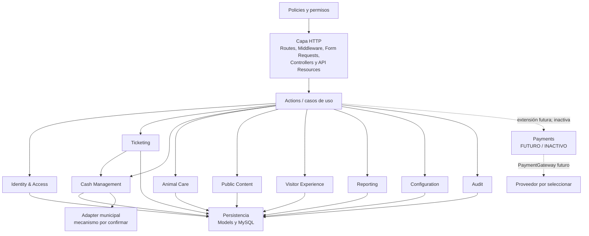

# Componentes — C4 nivel 3 conceptual

## API general



Los diez dominios son límites de ownership, no aprobación de tablas, endpoints ni clases. El flujo activo de V1 es Ticketing → Cash Management: venta solo en efectivo, emisión y movimiento de caja. Payments está separado y no participa en ese flujo; no hay implementación ni forma de activarlo.

## Clientes

```mermaid
flowchart LR
  View[View / Page] --> VM[ViewModel hook]
  VM --> Client[@arca/api-client]
  Client --> API[apps/api]
```

Las Views no acceden directamente a transporte ni ejecutan reglas. Los ViewModels coordinan estado de presentación y el cliente tipado conserva el contrato. Adaptadores específicos aíslan APIs del dispositivo.

## Capas transversales

Autorización se aplica antes del caso de uso; auditoría registra operaciones sensibles. Persistencia pertenece a la API. Integraciones externas usan Adapter/Anti-Corruption Layer, outbox e idempotencia cuando la spec lo justifique. Véanse [patrones](../08-patrones-arquitectonicos.md).
