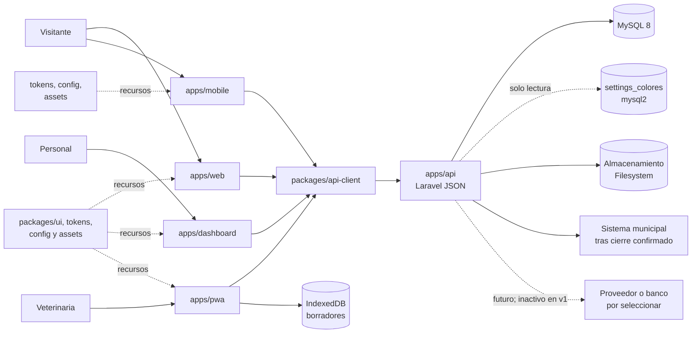

# Contenedores — C4 nivel 2 conceptual

| Relación | Protocolo | Datos | Confianza | Estado |
|---|---|---|---|---|
| Personas → clientes | HTTPS/UI | Interacciones según rol | Zona pública o autenticada | Propuesto |
| Clientes → `api-client` → API | HTTPS JSON `/api/v1` | Solicitudes y respuestas tipadas | Autenticado o público por recurso | Propuesto |
| API → MySQL 8 | Conexión MySQL por entorno | Datos de negocio | Red privada | Propuesto |
| API → `settings_colores` | MySQL `mysql2`, solo lectura | Tema validado | Fuente externa restringida | Actual externo |
| PWA → IndexedDB | API del navegador | Borradores no autoritativos | Dispositivo, riesgo elevado | Propuesto, ADR 0003 |
| API → almacenamiento | Laravel Filesystem | Archivos autorizados | Servicio intercambiable | Propuesto |
| API → sistema municipal | **Por confirmar** | Ingresos y cortes tras cierre confirmado | Límite institucional | Disparador confirmado; mecanismo pendiente |
| API → proveedor/banco | Sin protocolo definido | Pagos electrónicos futuros | Tercero no seleccionado | **Futuro/inactivo** |

V1 procesa boletos **solo en efectivo**. El contenedor de proveedor no existe ni está desplegado; no representa endpoint, SDK ni feature flag actual.
