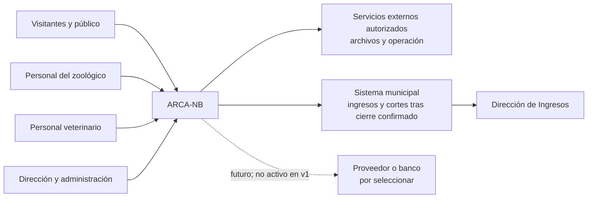

# Contexto — C4 nivel 1 conceptual

ARCA-NB sirve al público y al personal del zoológico. La Dirección de Ingresos recibe información mediante el sistema municipal después de un cierre confirmado; el mecanismo permanece por confirmar. El proveedor/banco es futuro y no participa en V1.

## Límites

- V1 vende boletos **solo en efectivo**.
- El enlace municipal se activa conceptualmente tras el cierre confirmado, pero BD directa o servicio interno, protocolo y contrato están por confirmar.
- El enlace discontinuo al proveedor representa una extensión **FUTURA/INACTIVA**, no software desplegado ni autorizado.
- Servicios externos deben permanecer detrás de interfaces portables y sin secretos en clientes.
