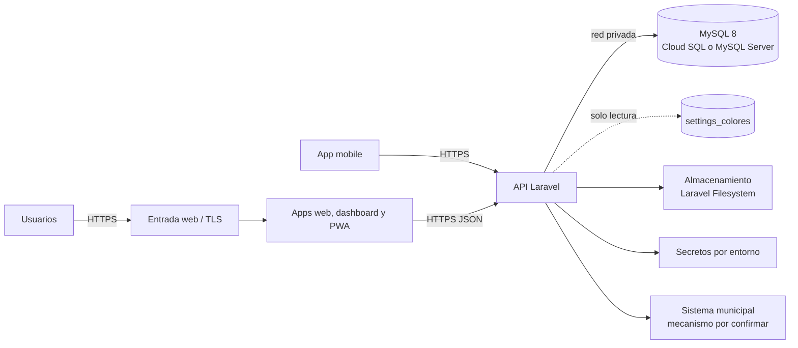

# Despliegue conceptual

No hay infraestructura implementada. La topología prevista debe ser portable entre GCP y un entorno local equivalente.

## Controles

- HTTPS termina en una entrada administrada; API y BD no se exponen innecesariamente.
- MySQL 8 estándar y configuración `.env` permiten Cloud SQL o MySQL Server local.
- Secretos se inyectan fuera del repositorio y se rotan; nunca llegan a clientes.
- Archivos usan un disco Laravel intercambiable, sin SDK propietario en el dominio.
- Observabilidad no registra tokens, datos clínicos sensibles ni datos de tarjeta.
- Backups, recuperación, regiones, DNS, red y servicio de cómputo se concretan en specs de infraestructura.

## Equivalencia local

Una entrada HTTP local sustituye al balanceador, MySQL Server sustituye al servicio administrado y un disco local sustituye al almacenamiento cloud. El código de dominio y contratos no cambian; solo configuración y operación.

## Futuro no desplegado: Payments

Payments es **FUTURO/INACTIVO** y V1 usa solo efectivo. No se muestran endpoints, webhooks, SDK, proveedor ni feature flag porque no existen ahora. Una spec futura definirá topología, aislamiento, secretos, webhook público verificado, sandbox y controles antes de cualquier despliegue.
