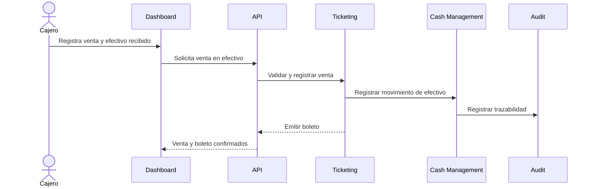
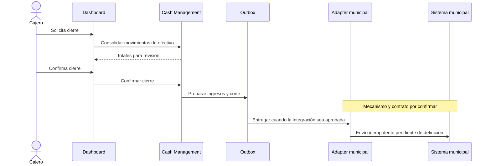
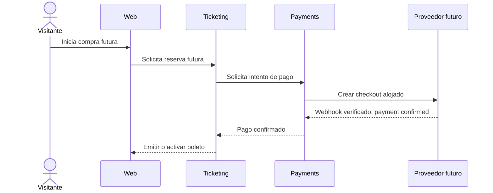
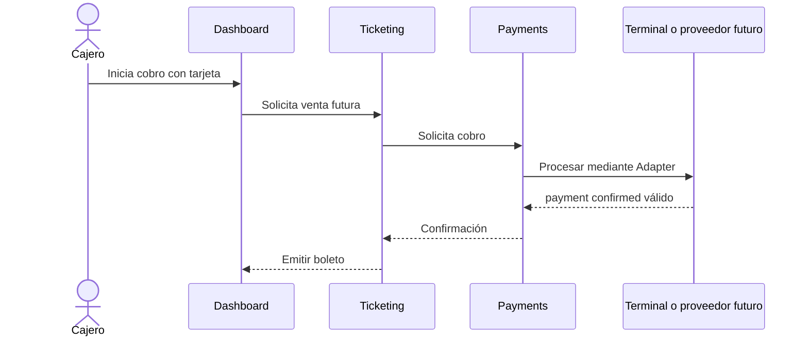
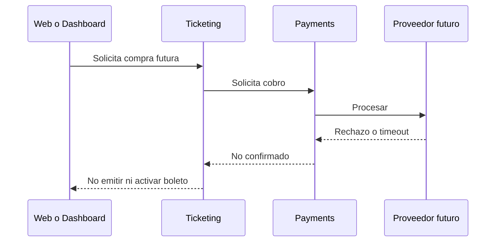

# Secuencias

## Activa V1: venta solo en efectivo

## Activa V1: cierre e integración municipal

El cierre confirmado es el disparador acordado; no se afirma si la conexión será BD directa o servicio interno.

## Escenarios futuros no implementados

Los siguientes diagramas son escenarios de diseño, **no contratos ni autorización de implementación**. Payments está FUTURO/INACTIVO; V1 solo efectivo y hoy no hay código, tablas, endpoints, SDK ni feature flag de pagos.

### Pago online futuro

### Tarjeta en taquilla futura

### Rechazo o timeout futuro

