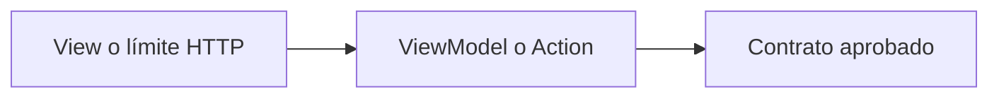

# Arquitectura de `apps/<app>`

> Copiar a `apps/<app>/docs/arquitectura.md`. No completar con supuestos: enlazar decisiones pendientes.

## 1. Control

- **Estado:** Borrador | Propuesta | Aceptada
- **Responsable:**
- **PR de aprobación:**
- **Capacidades descritas:** marcar cada una como `actual`, `propuesta` o `futura`.

## 2. Propósito, alcance y exclusiones

- Problema y propósito:
- Incluye:
- No incluye:
- Capacidades futuras (no implementadas):

## 3. Actores

| Actor | Necesidad | Permiso o confianza |
|---|---|---|
| | | |

## 4. Módulos internos

| Módulo/feature | Estado | Responsabilidad | Dueño de datos |
|---|---|---|---|
| | actual/propuesta/futura | | |

## 5. Estructura prevista en `src/`

```text
src/
  <describir carpetas sin crear código>
```

Justificar organización por features y límites de importación.

## 6. Patrón MVC o MVVM

- API Laravel: describir MVC en límite HTTP y delegación a Actions.
- React/React Native: describir View/Page → ViewModel hook → `@arca/api-client`.
- Patrón aplicable a esta app y excepciones aprobadas mediante ADR:

## 7. Componentes

| Componente | Estado | Entrada/salida | Responsabilidad |
|---|---|---|---|
| | | | |

## 8. Dependencias

Separar internas, compartidas y externas. Toda tecnología nueva enlaza ADR aprobado. Indicar dirección y dependencias prohibidas.

## 9. Endpoints consumidos o expuestos

| Contrato | Consume/expone | Estado | Autorización | Spec dueña |
|---|---|---|---|---|
| | | actual/propuesto/futuro | | |

No presentar un contrato conceptual como endpoint existente.

## 10. Datos y flujo

Documentar fuente de verdad, persistencia, auditoría, offline, sincronización y retención. Incluir flujo feliz y fallos.

## 11. Seguridad, errores y privacidad

Autenticación, autorización del servidor, secretos, validación, datos sensibles, correlación, mensajes y degradación segura.

## 12. Pruebas

Mapear componentes y contratos a pruebas unitarias, integración, contrato, UI y seguridad. Cada CA de una spec debe tener al menos una prueba automatizada.

## 13. Diagrama de componentes



## 14. Secuencias críticas

```mermaid
sequenceDiagram
  participant Actor
  participant App
  participant API
  Actor->>App: Intención
  App->>API: Contrato aprobado
  API-->>App: Resultado
```

## 15. Riesgos, pendientes y ADRs

| Riesgo/pregunta | Mitigación o decisión requerida | ADR/spec | Responsable |
|---|---|---|---|
| | | | |

## 16. Validación

- [ ] Respeta la línea base documentada en `docs/02-arquitectura.md` y `CONSTITUTION.md`.
- [ ] Estados actual/propuesto/futuro son inequívocos.
- [ ] MVC o MVVM está explícito según la app.
- [ ] No inventa entidades, contratos ni integraciones.
- [ ] Seguridad, permisos, errores, privacidad y pruebas están cubiertos.
- [ ] Excepciones enlazan un ADR aprobado.

## Participación futura en Payments

Si esta app pudiera participar en pagos, describir solo sus límites en esta sección y marcarla **FUTURA/INACTIVA**. V1 usa solo efectivo. No implementar código, tablas, endpoints, SDK ni feature flag de pagos. La implementación exige spec futura, ADR/proveedor y aprobación; el boleto solo se emite o activa tras confirmación válida.
